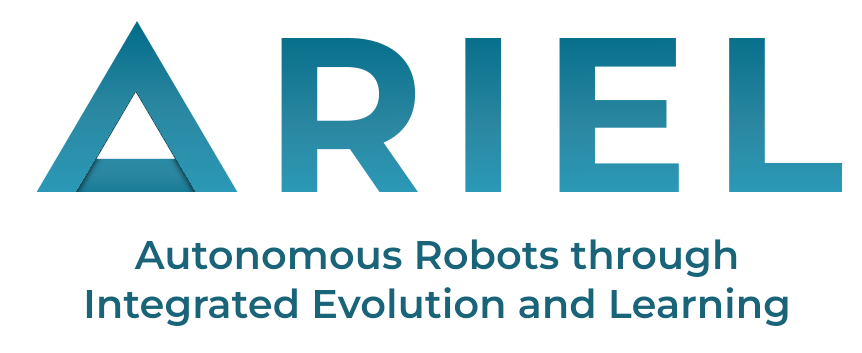

# ARIEL: Autonomous Robots through Integrated Evolution and Learning

[](https://www.python.org/)
[](https://mujoco.org/)
[](./LICENSE)
[](https://ci-group.github.io/ariel/)
[](https://github.com/astral-sh/ruff)
[](https://github.com/AndrzejSzczepura/EvolutionaryComputing2026)

ARIEL is a research framework, developed by the [Computational Intelligence Group](https://cs.vu.nl/ci/) at the Vrije Universiteit Amsterdam, for the joint evolution and learning of modular robots in simulation.

This is the ARIEL fork for the Evolutionary Computing course, 2026 edition. Course assignment
materials will be added into `/assignments` as the course progresses.

## Overview

**ARIEL** is a research framework for the evolution and learning of modular robots. It couples an evolutionary computation (EC) engine with a [MuJoCo](https://mujoco.org/)-based simulation stack, allowing robot *bodies* (morphologies) and *brains* (controllers) to be co-evolved and optimised within a single, consistent pipeline.

The framework is organised around a few core ideas:

- **Genotypes**: encodings that generate robot bodies and/or brains (tree genomes, CPPN/NEAT, and a Neural Developmental Encoding "NDE").
- **Phenotypes**: the RoboGen-lite modular body construction system that turns a genotype into a buildable robot made of cores, bricks and hinges.
- **Controllers**: neural and central-pattern-generator (CPG) controllers that drive the robot's joints.
- **Simulation**: terrains/environments, tasks (locomotion, gait learning, turning) and a MuJoCo worker that evaluates an individual and reports its
  fitness.
- **EC engine**: reusable building blocks (populations, individuals, selection/crossover, archive) for assembling evolutionary algorithms.
- **Visualisation**: dashboards and analysis tools for inspecting results.

## Features

- 🧠 **Body–brain co-optimisation**: 
  - evolve / learn a controller for a fixed body
  - evolve bodies and brains simultaneously
  - evolve robot bodies and brains simultaneously augmented with lifetime learning.
- 🤖 **Modular bodies**: Robot construction from cores, bricks and hinges, plus a library of prebuilt robots (gecko, spider, …).
- 🧬 **Multiple genotypes**: tree genomes, CPPN/NEAT, and a Neural Developmental Encoding (NDE).
- 🌍 **MuJoCo simulation**: ready-made terrains (flat, rugged, crater, tilted, Olympic arena) and tasks (targeted locomotion, gait learning,
  turning in place).
- 🔁 **Reusable EC engine**: composable populations, individuals, operators, and an archive, decoupled from the simulation layer.
- 💾 **Built-in logging**: runs are persisted to a SQLite database for later analysis and replay.
- 📊 **Visualisation**: dashboards and plotting utilities for results.

## Documentation
[ARIEL main documentation page](https://ci-group.github.io/ariel/)

## Quickstart

After [installing](#installation-and-running), build a prebuilt robot, drop it into a world, and launch the MuJoCo viewer:

```python
import mujoco
from mujoco import viewer

from ariel.simulation.environments import SimpleFlatWorld
from ariel.body_phenotypes.robogen_lite.prebuilt_robots.gecko import gecko

# 1. Create a world (a flat terrain)
world = SimpleFlatWorld()

# 2. Build a modular robot body and spawn it into the world
robot = gecko()                       # returns a CoreModule
world.spawn(robot.spec, position=[0, 0, 0.1])

# 3. Compile to a MuJoCo model + data
model = world.spec.compile()
data = mujoco.MjData(model)

# 4. Watch it in the interactive viewer
viewer.launch(model, data)
```

From here, see [`examples/`](examples/) for adding controllers, defining fitness, and running full evolutionary loops.

## Requirements

- **Python** ≥ 3.12
- **MuJoCo** ≥ 3.3.6
- **[uv](https://docs.astral.sh/uv/)** for environment and dependency management

All Python dependencies are declared in [`pyproject.toml`](pyproject.toml) and are installed automatically by `uv sync`.

## Installation and Running

This project uses [uv](https://docs.astral.sh/uv/).

To run the code examples, please do:
1. Clone the repository
```bash
git clone https://github.com/AndrzejSzczepura/EvolutionaryComputing2026.git
cd EvolutionaryComputing2026
```
2. Create a uv virtual environment inside the repository folder
```bash
  uv venv
```
3. Sync the virtual environment with the requirements
```bash
uv sync
```
4. Run an example, in this case, brain evolution (aka learning) using:
```bash
uv run examples/re_book/1_brain_evolution.py
```

## Repository Structure

```
ariel/
├── src/ariel/                      # Main package
│   ├── body_phenotypes/            # Genotype → robot body construction
│   │   ├── robogen_lite/           # RoboGen-lite modular body system
│   │   │   ├── modules/            #   Body parts: core, brick, hinge
│   │   │   ├── decoders/           #   Genotype-to-body decoders (hi-prob, CPPN, vector)
│   │   │   ├── cppn_neat/          #   CPPN/NEAT genome implementation
│   │   │   ├── prebuilt_robots/    #   Ready-made bodies (gecko, spider, ...)
│   │   │   ├── constructor.py      #   Assembles modules into a MuJoCo spec
│   │   │   └── config.py
│   │   └── lynx_mjspec/            # Lynx robot arm body + evolve/replay pipeline
│   ├── ec/                         # Evolutionary computation engine
│   │   ├── genotypes/              #   Encodings: tree, cppn, nde (neural dev. encoding)
│   │   ├── population.py           #   Population container
│   │   ├── individual.py           #   Individual (genotype + fitness + state)
│   │   ├── archive.py              #   Archive of historical individuals
│   │   ├── crossover.py            #   Variation operators
│   │   ├── generators.py           #   Genotype generators + mutators
│   │   └── ea.py                   #   EA orchestration
│   ├── simulation/                 # MuJoCo simulation stack
│   │   ├── environments/           #   Terrains/worlds (flat, rugged, crater, arena, ...)
│   │   ├── tasks/                  #   Tasks (targeted locomotion, gait, turning)
│   │   ├── controllers/            #   Controllers (CPG variants, neural)
│   │   └── mujoco_worker.py        #   Evaluates an individual, returns fitness
│   ├── parameters/                 # Shared types, module defs, MuJoCo params
│   ├── utils/                      # Renderers, trackers, video, optimizers, descriptors
│   └── visualisation/              # Dashboards and analysis tooling
├── examples/                       # Runnable examples
│   ├── a_mujoco/                   #   MuJoCo basics (launcher, rendering, cameras)
│   ├── b_robots/                   #   Building robots from graphs/decoders
│   ├── c_genotypes/                #   Body/brain evolution with genotypes
│   ├── re_book/                    #   "Robot Evolution" book walkthrough examples
│   └── z_ec_course/                #   EC course assignment templates
├── tests/                          # Unit and functional tests
├── docs/                           # Sphinx documentation sources
├── pyproject.toml                  # Project metadata and dependencies (uv)
└── noxfile.py                      # Automation sessions (tests, docs, compiled build)
```

Simulation runs write output to a local `__data__/` directory (created on first run).

## Examples

The [`examples/`](examples/) folder is the best entry point for learning the framework. A good reading order is:

1. [`examples/a_mujoco/`](examples/a_mujoco/): MuJoCo fundamentals: launching a simulation, rendering frames, recording video, and cameras.
2. [`examples/b_robots/`](examples/b_robots/): turning genotypes/graphs into robot bodies and placing them on terrains.
3. [`examples/re_book/`](examples/re_book/): end-to-end brain evolution, then body-brain evolution, learning, and waypoint-following tasks.
4. [`examples/c_genotypes/`](examples/c_genotypes/): body/brain joint evolution, multiprocessing, and replaying results from a database.

## Citation

Papers about ARIEL have been accepted for publication at **ALIFE 2026** and **PPSN 2026**. Citation entries for those papers will be added here once they are published.

In the meantime, if you use ARIEL in your research, please cite the repository:

```bibtex
@unpublished{ariel,
    author = {Di Matteo, Jacopo Michele and Grigoriadis, Ioannis and Aron Richard Ferencz and Lilly Schwarzenbach and Agoston Eiben},
    title  = {ARIEL: Autonomous Robots through Integrated Evolution and Learning},
    year   = {2026},
    note   = {https://github.com/ci-group/ariel}
}
```

<!-- TODO: replace with the official ALIFE 2026 and PPSN 2026 citations once published. -->

## License

Distributed under the terms of the [GPL-3.0 license](LICENSE). ARIEL is free and open source software.
